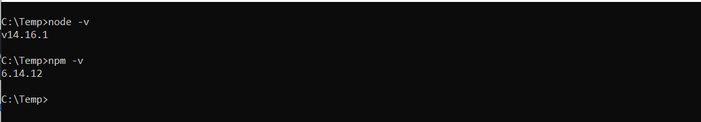
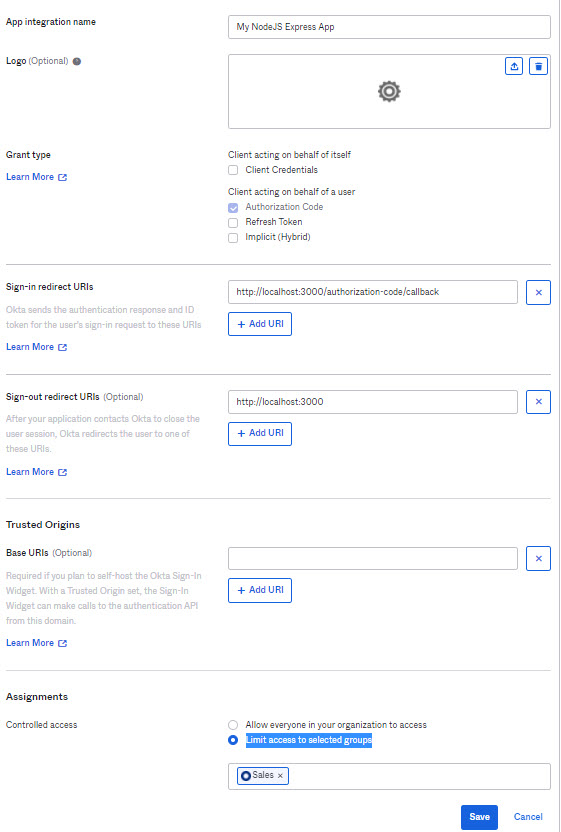
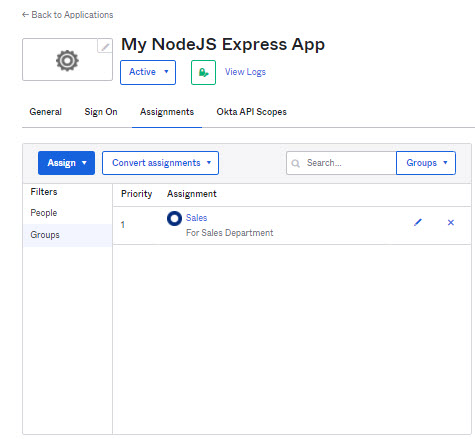
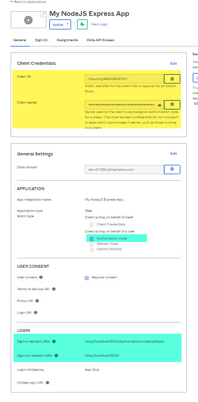
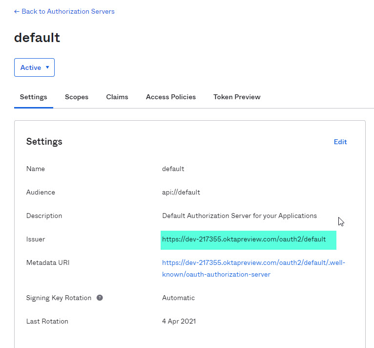
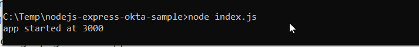
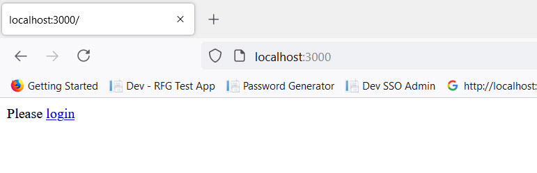
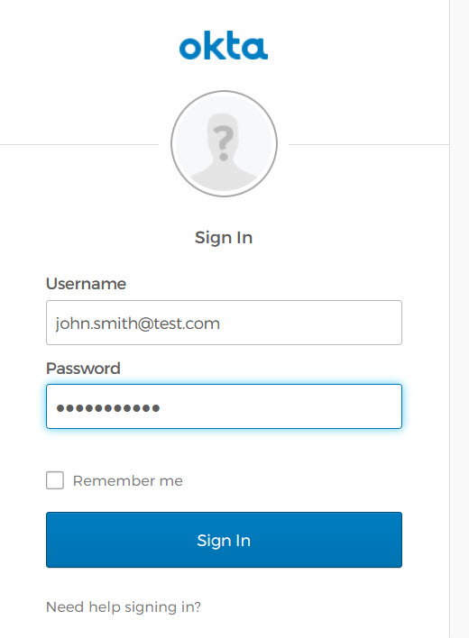
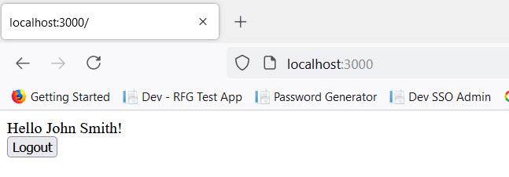
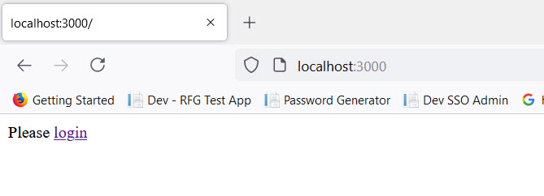

# NodeJS Express Sample OIDC Application for your Okta Org

This repository contains a sample Node JS application that uses Express framework.
It uses OpenID Connect library to integrate with your Okta org.

## Prerequisites
   1. Make sure you have Node.js installed on your machine <br/>
      To check version of Node.js and NPM, run the below commands on your command prompt <br/>
      Check the versions of NodeJS and NPM

      ```
      node -v
      npm -v
      ```
       
      <br/>
      
      <br/>
      If you need to download Node.js then you can download from here https://nodejs.org/en/download/
      
      <br/>
   2. Sign up for [Okta Developer Edition](http://developer.okta.com/).    
       You'll need an Okta *organization* of your own to use as you follow this guide. After activating your account, log in to it. If you just created an account, you'll see a        screen similar to the one below. Click on **< > Developer Console** in the top-left corner and switch to the Classic UI.

## How to integrate this application with your Okta Org

Please follow these steps to configure and run this application in your NodeJS environment

1. Download the sample application from git
   <br/>
   git clone https://github.com/sami-dev/nodejs-express-okta-sample.git

2. Run the below command <br/>
   ```
   npm install
   ```
   <br/>
   
   - npm install downloads dependencies defined in a package. json file and generates a node_modules folder with the installed modules

3. Configure a Web Application in your Okta Org
   * Login to your Okta Org
   * Go to Applications --> Applications
      - Click on Create new application
   * Provide below information in "Create a new app integration" wizard
      - Select Sign-On method as OIDC - OpenID Connect
      - Select Application type as "Web Application"
      <br/>
      
   * Provide Application configuration information and assign application to user groups
      For Example:
      - Application Name: My NodeJS Express App
      - Grant Type: Authorization Code
      - Sign-in Redirect URIs: http://localhost:3000/authorization-code/callback
      - Sign-out Redirect URIs: http://localhost:3000
      - Assignments: Limit access to selected groups : Sales
      <br/>
      
   *  Review the application configuration and group assignments
      <br/>
      
   *  Copy the Client Id and Client secret from the application configuration
      <br/>
      
   *  Go to Security --> API --> Authorization servers --> default
      - Copy the issuer information
      <br/>
      
4. Update the OIDC configuration inside index.js
   <br/>
   Open the application code in a text editor and update the OIDC configuration
   ```
      const oidc = new ExpressOIDC({
        issuer: "https://dev-####.oktapreview.com/oauth2/default",
        client_id: "################",
        client_secret: "#######################",
        appBaseUrl: "http://localhost:3000",
        scope: "openid profile",
      });
   ```
5. Run the application
   * Start the application
      ```
      node index.js
      ```
      <br/>
      
   * Access the application in a new browser window
      - http://localhost:3000/
     <br/>
     
   * Click on Login link and login page should appear
      <br/>
      
   * Login with an active account of your Okta org
   * After login, you should see a Welcome message
      <br/>
      
   * Click on Logout to make sure logout is working fine
      <br/>
      

